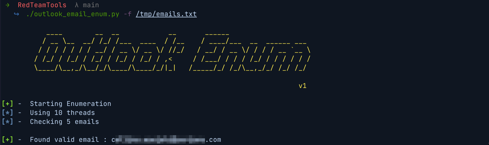
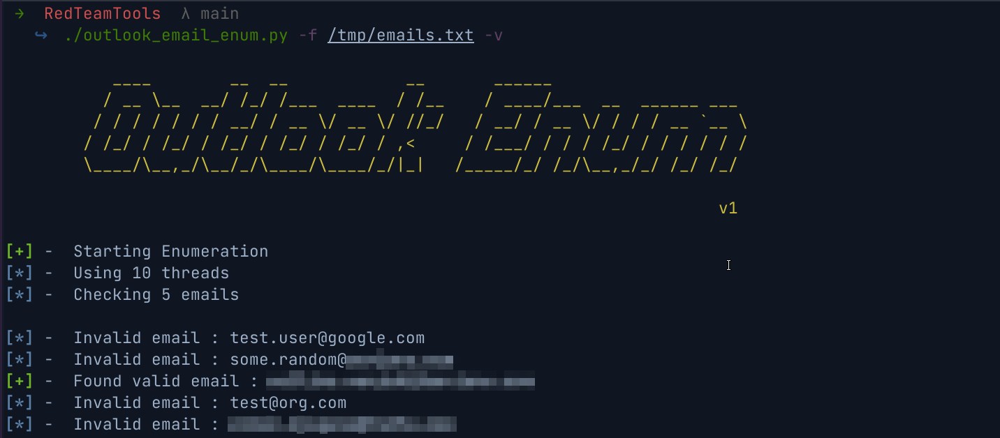

# RedTeamTools
Collection of offensive security tools and scripts I have built :)


# Catalog
* [Outlook Email Enumerator](#outlook-email-enumerator)


### Outlook Email Enumerator
* This scripts enumerates valid emails from a list or provided emails. Below is the command line help menu showing the syntax
```sh
 $ outlook_email_enum.py -h
usage: outlook_email_enum.py [-h] -f FILE [-v] [-s] [-t THREADS]

options:
  -h, --help            show this help message and exit
  -f FILE, --file FILE  File containing emails to check
  -v, --verbose         Enable verbose mode
  -s, --silent          Show minimal info, only show valid emails
  -t THREADS, --threads THREADS
                        Number of threads to use
```
* `Basic Email Enumeration`
	

* `Email Enumeration in verbose mode`
	

